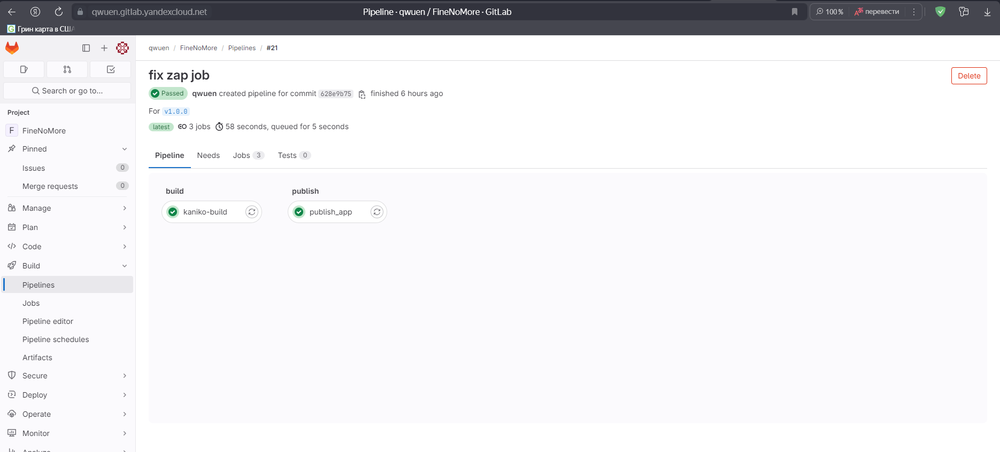

## DevSecOps в облачном CI/CD

[Ссылка на сертификат](certificate.md)

<details>
<summary>1. Создание рабочего места в облаке</summary>

[Директория файлами terraform](/workspace/)  
[Команды настройки ВМ](vm_setup.bash)  
[Команды настройки Visual Studio Code Server](/visual-studio-code-server.bash)  

```sh
D:\projects\devsecops-yandex-practicum\workplace>terraform plan
yandex_iam_service_account.k8s-sa: Refreshing state... [id=ajeb1u8n5gsob94toltv]
yandex_container_registry.default: Refreshing state... [id=crpoa5fimv6i7llecfm5]
yandex_vpc_network.k8s-network: Refreshing state... [id=enp8losbbaebjnn58vid]
yandex_resourcemanager_folder_iam_binding.editor: Refreshing state... [id=b1gl3metlnuer73pnqmi/editor]
yandex_resourcemanager_folder_iam_binding.images-puller: Refreshing state... [id=b1gl3metlnuer73pnqmi/container-registry.images.puller]
yandex_vpc_subnet.k8s-subnet: Refreshing state... [id=e9b38p97cppfj5kj3lso]
yandex_kubernetes_cluster.k8s-master: Refreshing state... [id=cattp8v3d9lk8p8sl1k4]
yandex_kubernetes_node_group.k8s_node_group: Refreshing state... [id=cat8l18vru1coigkc7kr]

No changes. Your infrastructure matches the configuration.

Terraform has compared your real infrastructure against your configuration and found no differences, so no changes are
needed.

D:\projects\devsecops-yandex-practicum\workplace>terraform state list
yandex_container_registry.default
yandex_iam_service_account.k8s-sa
yandex_kubernetes_cluster.k8s-master
yandex_kubernetes_node_group.k8s_node_group
yandex_resourcemanager_folder_iam_binding.editor
yandex_resourcemanager_folder_iam_binding.images-puller
yandex_vpc_network.k8s-network
yandex_vpc_subnet.k8s-subnet

D:\projects\devsecops-yandex-practicum\workplace>
```

</details>


<details>

<summary>2. Разворачивание инфраструктуры</summary>

[Директория файлами terraform](/infrastructure/)  
[Команды настройки кластера](/infrastructure/scripts/)  

```bash
ubuntu@fhmc1tortl691h098sgm $ cd workplace/
18:55:50:[~/workplace]
ubuntu@fhmc1tortl691h098sgm $ terraform plan
yandex_vpc_network.k8s-network: Refreshing state... [id=enp8losbbaebjnn58vid]
yandex_container_registry.default: Refreshing state... [id=crpoa5fimv6i7llecfm5]
yandex_iam_service_account.k8s-sa: Refreshing state... [id=ajeb1u8n5gsob94toltv]
yandex_resourcemanager_folder_iam_binding.editor: Refreshing state... [id=b1gl3metlnuer73pnqmi/editor]
yandex_resourcemanager_folder_iam_binding.images-puller: Refreshing state... [id=b1gl3metlnuer73pnqmi/container-registry.images.puller]
yandex_vpc_subnet.k8s-subnet: Refreshing state... [id=e9b38p97cppfj5kj3lso]
yandex_kubernetes_cluster.k8s-master: Refreshing state... [id=cattp8v3d9lk8p8sl1k4]
yandex_kubernetes_node_group.k8s_node_group: Refreshing state... [id=cat8l18vru1coigkc7kr]

No changes. Your infrastructure matches the configuration.

Terraform has compared your real infrastructure against your configuration and found no differences, so no changes are needed.
18:56:03:[~/workplace]
ubuntu@fhmc1tortl691h098sgm $ terraform state list
yandex_container_registry.default
yandex_iam_service_account.k8s-sa
yandex_kubernetes_cluster.k8s-master
yandex_kubernetes_node_group.k8s_node_group
yandex_resourcemanager_folder_iam_binding.editor
yandex_resourcemanager_folder_iam_binding.images-puller
yandex_vpc_network.k8s-network
yandex_vpc_subnet.k8s-subnet
18:56:12:[~/workplace]
ubuntu@fhmc1tortl691h098sgm $ 

```

</details>

<details>
<summary>3. Скриншоты рабочей инфраструктуры</summary>

- Application


- Набор ВМ


- Кластер Kubernetes


- Gitlab CI


- Gitlab repository


- Gitlab test pipeline


- Gitlab deploy pipeline


- DefectDojo


</details>

<details>
<summary>4. Kubernetes resources</summary>

```bash
ubuntu@fhmc1tortl691h098sgm $ kubectl get all -A
NAMESPACE                              NAME                                             READY   STATUS             RESTARTS        AGE
default                                pod/gitlab-runner-5877879c46-qjjm9               1/1     Running            5 (9h ago)      7d
default                                pod/ingress-nginx-controller-65487c9954-9vfxn    1/1     Running            5 (9h ago)      8d
defectdojo                             pod/defectdojo-celery-beat-84cbbd4f7d-5kmkk      1/1     Running            2 (22h ago)     4d6h
defectdojo                             pod/defectdojo-celery-worker-79fc56b8dd-545jt    1/1     Running            2 (22h ago)     4d6h
defectdojo                             pod/defectdojo-django-6b6c968c64-lsg46           2/2     Running            4 (22h ago)     4d6h
defectdojo                             pod/defectdojo-postgresql-0                      1/1     Running            2 (22h ago)     4d6h
defectdojo                             pod/defectdojo-rabbitmq-0                        1/1     Running            2 (22h ago)     4d6h
finenomore                             pod/finenomore-5559799878-qwmqk                  1/1     Running            0               6h25m
finenomore                             pod/postgres-6fc48f955b-frfjh                    1/1     Running            1 (7h44m ago)   7h45m
gitlab-agent-finenomore-gitlab-agent   pod/finenomore-gitlab-agent-v2-55485c9c6-6kg64   0/1     ImagePullBackOff   0               14m
gitlab-agent-finenomore-gitlab-agent   pod/finenomore-gitlab-agent-v2-7649d67fc-7dqxv   1/1     Running            4 (22h ago)     6d22h
gitlab-agent-finenomore-gitlab-agent   pod/finenomore-gitlab-agent-v2-7649d67fc-cxnt4   1/1     Running            4 (22h ago)     6d22h
kube-system                            pod/coredns-57b57bfc5b-s8bt5                     1/1     Running            5 (22h ago)     8d
kube-system                            pod/ip-masq-agent-7slmv                          1/1     Running            5 (22h ago)     8d
kube-system                            pod/kube-dns-autoscaler-bd7cc5977-ncw7n          1/1     Running            5 (22h ago)     8d
kube-system                            pod/kube-proxy-hg4g5                             1/1     Running            5 (22h ago)     8d
kube-system                            pod/metrics-server-6f485d9c99-zxbdm              2/2     Running            11 (22h ago)    8d
kube-system                            pod/npd-v0.8.0-kjjtv                             1/1     Running            5 (22h ago)     8d
kube-system                            pod/yc-disk-csi-node-v2-ns7xg                    6/6     Running            30 (22h ago)    8d

NAMESPACE     NAME                                         TYPE           CLUSTER-IP      EXTERNAL-IP      PORT(S)                                 AGE
default       service/ingress-nginx-controller             LoadBalancer   10.96.197.87    158.160.166.81   80:31657/TCP,443:31391/TCP              8d
default       service/ingress-nginx-controller-admission   ClusterIP      10.96.177.240   <none>           443/TCP                                 8d
default       service/kubernetes                           ClusterIP      10.96.128.1     <none>           443/TCP                                 8d
defectdojo    service/defectdojo-django                    ClusterIP      10.96.150.240   <none>           80/TCP                                  4d6h
defectdojo    service/defectdojo-postgresql                ClusterIP      10.96.233.255   <none>           5432/TCP                                4d6h
defectdojo    service/defectdojo-postgresql-hl             ClusterIP      None            <none>           5432/TCP                                4d6h
defectdojo    service/defectdojo-rabbitmq                  ClusterIP      10.96.228.200   <none>           5672/TCP,4369/TCP,25672/TCP,15672/TCP   4d6h
defectdojo    service/defectdojo-rabbitmq-headless         ClusterIP      None            <none>           4369/TCP,5672/TCP,25672/TCP,15672/TCP   4d6h
finenomore    service/finenomore                           ClusterIP      10.96.224.163   <none>           80/TCP                                  8d
finenomore    service/postgres                             ClusterIP      10.96.165.16    <none>           5432/TCP                                8d
kube-system   service/kube-dns                             ClusterIP      10.96.128.2     <none>           53/UDP,53/TCP,9153/TCP                  8d
kube-system   service/metrics-server                       ClusterIP      10.96.225.177   <none>           443/TCP                                 8d

NAMESPACE     NAME                                            DESIRED   CURRENT   READY   UP-TO-DATE   AVAILABLE   NODE SELECTOR                                                                        AGE
kube-system   daemonset.apps/ip-masq-agent                    1         1         1       1            1           beta.kubernetes.io/os=linux,node.kubernetes.io/masq-agent-ds-ready=true              8d
kube-system   daemonset.apps/kube-proxy                       1         1         1       1            1           kubernetes.io/os=linux,node.kubernetes.io/kube-proxy-ds-ready=true                   8d
kube-system   daemonset.apps/npd-v0.8.0                       1         1         1       1            1           beta.kubernetes.io/os=linux,node.kubernetes.io/node-problem-detector-ds-ready=true   8d
kube-system   daemonset.apps/nvidia-device-plugin-daemonset   0         0         0       0            0           beta.kubernetes.io/os=linux,node.kubernetes.io/nvidia-device-plugin-ds-ready=true    8d
kube-system   daemonset.apps/yc-disk-csi-node                 0         0         0       0            0           <none>                                                                               8d
kube-system   daemonset.apps/yc-disk-csi-node-v2              1         1         1       1            1           yandex.cloud/pci-topology=k8s                                                        8d

NAMESPACE                              NAME                                         READY   UP-TO-DATE   AVAILABLE   AGE
default                                deployment.apps/gitlab-runner                1/1     1            1           7d8h
default                                deployment.apps/ingress-nginx-controller     1/1     1            1           8d
defectdojo                             deployment.apps/defectdojo-celery-beat       1/1     1            1           4d6h
defectdojo                             deployment.apps/defectdojo-celery-worker     1/1     1            1           4d6h
defectdojo                             deployment.apps/defectdojo-django            1/1     1            1           4d6h
finenomore                             deployment.apps/finenomore                   1/1     1            1           8d
finenomore                             deployment.apps/postgres                     1/1     1            1           8d
gitlab-agent-finenomore-gitlab-agent   deployment.apps/finenomore-gitlab-agent-v2   2/2     1            2           6d22h
kube-system                            deployment.apps/coredns                      1/1     1            1           8d
kube-system                            deployment.apps/kube-dns-autoscaler          1/1     1            1           8d
kube-system                            deployment.apps/metrics-server               1/1     1            1           8d

NAMESPACE                              NAME                                                   DESIRED   CURRENT   READY   AGE
default                                replicaset.apps/gitlab-runner-5877879c46               1         1         1       7d
default                                replicaset.apps/gitlab-runner-66fb6cc99d               0         0         0       7d8h
default                                replicaset.apps/ingress-nginx-controller-65487c9954    1         1         1       8d
defectdojo                             replicaset.apps/defectdojo-celery-beat-84cbbd4f7d      1         1         1       4d6h
defectdojo                             replicaset.apps/defectdojo-celery-worker-79fc56b8dd    1         1         1       4d6h
defectdojo                             replicaset.apps/defectdojo-django-6b6c968c64           1         1         1       4d6h
finenomore                             replicaset.apps/finenomore-5559799878                  1         1         1       6h25m
finenomore                             replicaset.apps/finenomore-55cfbc8d9                   0         0         0       6d22h
finenomore                             replicaset.apps/finenomore-5698c9f645                  0         0         0       5d23h
finenomore                             replicaset.apps/finenomore-5b699dc9bd                  0         0         0       4d4h
finenomore                             replicaset.apps/finenomore-5f8fc685b                   0         0         0       4d6h
finenomore                             replicaset.apps/finenomore-5ffbfbc555                  0         0         0       8d
finenomore                             replicaset.apps/finenomore-69bc64d785                  0         0         0       7h45m
finenomore                             replicaset.apps/finenomore-7574fc4f94                  0         0         0       24h
finenomore                             replicaset.apps/postgres-57f65b78d9                    0         0         0       8d
finenomore                             replicaset.apps/postgres-6fc48f955b                    1         1         1       7h45m
finenomore                             replicaset.apps/postgres-df79fbbc6                     0         0         0       24h
gitlab-agent-finenomore-gitlab-agent   replicaset.apps/finenomore-gitlab-agent-v2-55485c9c6   1         1         0       14m
gitlab-agent-finenomore-gitlab-agent   replicaset.apps/finenomore-gitlab-agent-v2-7649d67fc   2         2         2       6d22h
kube-system                            replicaset.apps/coredns-57b57bfc5b                     1         1         1       8d
kube-system                            replicaset.apps/kube-dns-autoscaler-bd7cc5977          1         1         1       8d
kube-system                            replicaset.apps/metrics-server-54cb698b7f              0         0         0       8d
kube-system                            replicaset.apps/metrics-server-6f485d9c99              1         1         1       8d

NAMESPACE    NAME                                     READY   AGE
defectdojo   statefulset.apps/defectdojo-postgresql   1/1     4d6h
defectdojo   statefulset.apps/defectdojo-rabbitmq     1/1     4d6h
19:08:59:[~/workplace]
ubuntu@fhmc1tortl691h098sgm $ 

```
</details>

<details>
<summary>gitlab-ci</summary>

```yaml

include:
  - template: Security/Secret-Detection.gitlab-ci.yml
  - template: Security/SAST.gitlab-ci.yml
  - template: Security/Container-Scanning.gitlab-ci.yml

stages:
  - report-prepare
  - pre-build
  - build
  - post-build
  - test
  - report
  - deploy
  - publish

variables:
  IMAGE_NAME: "${CI_REGISTRY_IMAGE}/${CI_COMMIT_REF_SLUG}:${CI_COMMIT_SHA}"
  GITLAB_AGENT: "$CI_PROJECT_PATH:finenomore-gitlab-agent"
  DAST_NAME: finenomore-dast

  ###
  # DefectDojo
  ###
  # Global DefectDojo scan variables
  # Available values : Info, Low, Medium, High, Critical
  DEFECTDOJO_SCAN_MINIMUM_SEVERITY: "Info"
  DEFECTDOJO_SCAN_CLOSE_OLD_FINDINGS: "true"
  DEFECTDOJO_SCAN_ENVIRONMENT: "Default"

.deploy:
  image: dtzar/helm-kubectl:3.9
  before_script:
    - kubectl config use-context $GITLAB_AGENT
  rules:
    - if: $CI_COMMIT_BRANCH

.defectdojo_publish:
  stage: report
  image: alpine
  allow_failure: true
  before_script:
    - apk add curl coreutils
    - TODAY=`date +%Y-%m-%d`
  script:
    - |
      curl --insecure --fail --location --request POST "${DEFECTDOJO_URL}/import-scan/" \
          --header "Authorization: Token ${DEFECTDOJO_TOKEN}" \
          --form "scan_date=\"${TODAY}\"" \
          --form "minimum_severity=\"${DEFECTDOJO_SCAN_MINIMUM_SEVERITY}\"" \
          --form "scan_type=\"${DEFECTDOJO_SCAN_TYPE}\"" \
          --form "engagement=\"${DEFECTDOJO_ENGAGEMENTID}\"" \
          --form "file=@${DEFECTDOJO_SCAN_FILE}" \
          --form "close_old_findings=\"${DEFECTDOJO_SCAN_CLOSE_OLD_FINDINGS}\"" \
          --form "environment=\"${DEFECTDOJO_SCAN_ENVIRONMENT}\""
  rules:
    - if: $CI_COMMIT_BRANCH

defectdojo_create_engagement:
  stage: report-prepare
  image:
    name: alpine
  variables:
    GIT_STRATEGY: none
    DEFECTDOJO_ENGAGEMENT_PERIOD: 7
    DEFECTDOJO_ENGAGEMENT_STATUS: "Not Started"
    DEFECTDOJO_ENGAGEMENT_BUILD_SERVER: "null"
    DEFECTDOJO_ENGAGEMENT_SOURCE_CODE_MANAGEMENT_SERVER: "null"
    DEFECTDOJO_ENGAGEMENT_ORCHESTRATION_ENGINE: "null"
    DEFECTDOJO_ENGAGEMENT_DEDUPLICATION_ON_ENGAGEMENT: "false"
    DEFECTDOJO_ENGAGEMENT_THREAT_MODEL: "true"
    DEFECTDOJO_ENGAGEMENT_API_TEST: "true"
    DEFECTDOJO_ENGAGEMENT_PEN_TEST: "true"
    DEFECTDOJO_ENGAGEMENT_CHECK_LIST: "true"
  before_script:
    - apk add curl jq coreutils
    - TODAY=`date +%Y-%m-%d`
    - ENDDAY=$(date -d "+${DEFECTDOJO_ENGAGEMENT_PERIOD} days" +%Y-%m-%d)
  script:
    - |
      ENGAGEMENTID=`curl --insecure --fail --location --request POST "${DEFECTDOJO_URL}/engagements/" \
            --header "Authorization: Token ${DEFECTDOJO_TOKEN}" \
            --header 'Content-Type: application/json' \
              --data-raw "{
                \"tags\": [\"GITLAB-CI\"],
                \"name\": \"${CI_COMMIT_REF_NAME}#${CI_PIPELINE_ID}\",
                \"description\": \"${CI_COMMIT_DESCRIPTION}\",
                \"version\": \"${CI_COMMIT_REF_NAME}\",
                \"first_contacted\": \"${TODAY}\",
                \"target_start\": \"${TODAY}\",
                \"target_end\": \"${ENDDAY}\",
                \"reason\": \"string\",
                \"tracker\": \"${CI_PROJECT_URL}/-/issues\",
                \"threat_model\": \"${DEFECTDOJO_ENGAGEMENT_THREAT_MODEL}\",
                \"api_test\": \"${DEFECTDOJO_ENGAGEMENT_API_TEST}\",
                \"pen_test\": \"${DEFECTDOJO_ENGAGEMENT_PEN_TEST}\",
                \"check_list\": \"${DEFECTDOJO_ENGAGEMENT_CHECK_LIST}\",
                \"status\": \"${DEFECTDOJO_ENGAGEMENT_STATUS}\",
                \"engagement_type\": \"CI/CD\",
                \"build_id\": \"${CI_PIPELINE_ID}\",
                \"commit_hash\": \"${CI_COMMIT_SHORT_SHA}\",
                \"branch_tag\": \"${CI_COMMIT_REF_NAME}\",
                \"deduplication_on_engagement\": \"${DEFECTDOJO_ENGAGEMENT_DEDUPLICATION_ON_ENGAGEMENT}\",
                \"product\": \"${DEFECTDOJO_PRODUCTID}\",
                \"source_code_management_uri\": \"${CI_PROJECT_URL}\",
                \"build_server\": ${DEFECTDOJO_ENGAGEMENT_BUILD_SERVER},
                \"source_code_management_server\": ${DEFECTDOJO_ENGAGEMENT_SOURCE_CODE_MANAGEMENT_SERVER},
                \"orchestration_engine\": ${DEFECTDOJO_ENGAGEMENT_ORCHESTRATION_ENGINE}
              }" | jq -r '.id'`
    - echo "DEFECTDOJO_ENGAGEMENTID=${ENGAGEMENTID}" >> defectdojo.env
  artifacts:
    reports:
      dotenv: defectdojo.env
  rules:
    - if: $CI_COMMIT_BRANCH

secret_detection:
  stage: pre-build
  variables:
    SECRET_DETECTION_HISTORIC_SCAN: "true"
    GIT_STRATEGY: "clone"
  allow_failure: true
  script:
    - apk add jq
    - /analyzer run
    - exit $(eval "cat gl-secret-detection-report.json | jq --raw-output '.vulnerabilities | length'")
  artifacts:
    when: always
    paths:
      - gl-secret-detection-report.json

sast:
  stage: pre-build
  variables:
    SCAN_KUBERNETES_MANIFESTS: "true"
    KUBESEC_HELM_CHARTS_PATH: "./k8s/finenomore"
    SAST_EXCLUDED_ANALYZERS: "bandit,gosec,eslint"
  artifacts:
    paths:
      - ${CI_JOB_NAME}.json
  after_script:
    - mv gl-sast-report.json ${CI_JOB_NAME}.json

trivy-sca:
  stage: pre-build
  image:
    name: aquasec/trivy:0.34.0
    entrypoint: [""]
  script:
    - trivy fs -f json --output trivy-sca.json .
  artifacts:
    paths:
      - trivy-sca.json
  rules:
    - if: $CI_COMMIT_BRANCH

kaniko-build:
  image:
    name: gcr.io/kaniko-project/executor:v1.9.0-debug
    entrypoint: [""]
  stage: build
  script:
    - /kaniko/executor
      --context "${CI_PROJECT_DIR}"
      --dockerfile "${CI_PROJECT_DIR}/Dockerfile"
      --destination "${IMAGE_NAME}"
  rules:
    - if: $CI_COMMIT_BRANCH || $CI_COMMIT_TAG
      exists:
        - Dockerfile

container_scanning:
  stage: post-build

dast-prepare:
  extends: .deploy
  stage: test
  script:
    - LB_ADDRESS=$(kubectl get services ingress-nginx-controller --output jsonpath='{.status.loadBalancer.ingress[0].ip}')
    - APP_HOST=finenomore-dast.$LB_ADDRESS.sslip.io
    - helm upgrade --install $DAST_NAME ./k8s/finenomore
      --set namespace=$DAST_NAME
      --set finenomore.image=$IMAGE_NAME
      --set finenomore.imagePullSecrets=gitlab-credentials --atomic
      --set finenomore.ingress.host=$APP_HOST
    - echo "APP_ADDRESS is $APP_HOST"
    - echo "APP_ADDRESS=$APP_HOST" >> app.env
  artifacts:
    reports:
      dotenv: app.env

dast-scan:
  stage: test
  needs: ["dast-prepare"]
  image:
    name: owasp/zap2docker-stable:2.12.0
  script:
    - mkdir -p /zap/wrk
    - zap-full-scan.py -t "http://${APP_ADDRESS}" -I -x zap.xml
    - cp /zap/wrk/zap.xml .
  artifacts:
    when: always
    paths:
      - zap.xml
  rules:
    - if: $CI_COMMIT_BRANCH

dast-destroy:
  extends: .deploy
  stage: test
  needs: ["dast-scan"]
  script:
    - helm uninstall $DAST_NAME

dd_secret_detection:
  extends: .defectdojo_publish
  needs: ["defectdojo_create_engagement", "secret_detection"]
  variables:
    DEFECTDOJO_SCAN_FILE: gl-secret-detection-report.json
    DEFECTDOJO_SCAN_TYPE: "GitLab Secret Detection Report"

dd_semgrep_sast:
  extends: .defectdojo_publish
  needs: ["defectdojo_create_engagement", "semgrep-sast"]
  variables:
    DEFECTDOJO_SCAN_FILE: semgrep-sast.json
    DEFECTDOJO_SCAN_TYPE: "GitLab SAST Report"

dd_kubesec_sast:
  extends: .defectdojo_publish
  needs: ["defectdojo_create_engagement", "kubesec-sast"]
  variables:
    DEFECTDOJO_SCAN_FILE: kubesec-sast.json
    DEFECTDOJO_SCAN_TYPE: "GitLab SAST Report"

dd_trivy:
  extends: .defectdojo_publish
  needs: ["defectdojo_create_engagement", "trivy-sca"]
  variables:
    DEFECTDOJO_SCAN_FILE: trivy-sca.json
    DEFECTDOJO_SCAN_TYPE: "Trivy Scan"

dd_container_scanning:
  extends: .defectdojo_publish
  needs: ["defectdojo_create_engagement", "container_scanning"]
  variables:
    DEFECTDOJO_SCAN_FILE: gl-container-scanning-report.json
    DEFECTDOJO_SCAN_TYPE: "GitLab Container Scan"

dd_dast:
  extends: .defectdojo_publish
  needs: ["defectdojo_create_engagement", "dast-scan"]
  variables:
    DEFECTDOJO_SCAN_FILE: zap.xml
    DEFECTDOJO_SCAN_TYPE: "ZAP Scan"

deploy_app:
  extends: .deploy
  image: dtzar/helm-kubectl:3.9
  stage: deploy
  needs:
    [
      "semgrep-sast",
      "kubesec-sast",
      "container_scanning",
      "secret_detection",
      "trivy-sca",
      "dast-scan",
    ]
  script:
    - cd k8s/finenomore
    - helm upgrade --install finenomore .
      --set finenomore.image=${IMAGE_NAME}
      --set finenomore.imagePullSecrets=gitlab-credentials
      --atomic

publish_app:
  stage: publish
  image:
    name: gcr.io/go-containerregistry/crane:debug
    entrypoint: [""]
  script:
    - crane auth login -u $CI_REGISTRY_USER -p $CI_REGISTRY_PASSWORD $CI_REGISTRY
    - crane pull ${IMAGE_NAME} finenomore.tar
    - cat ${YCR_AUTH_KEY} | crane auth login
      --username json_key
      --password-stdin
      cr.yandex
    - crane push finenomore.tar cr.yandex/${YCR_REGISTRY_ID}/finenomore:$CI_COMMIT_TAG
    - crane push finenomore.tar cr.yandex/${YCR_REGISTRY_ID}/finenomore:latest
  rules:
    - if: $CI_COMMIT_TAG =~ /^v\d+.\d+.\d+-?.*$/

```

</details>